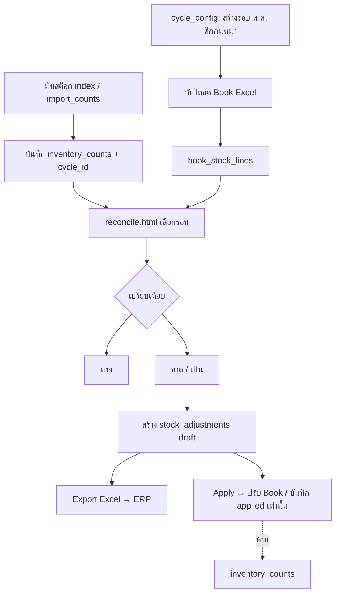

# ออกแบบระบบ Match / Reconcile (ยอดก่อนนับ vs ผลนับ)

## สรุปคำตอบสั้น ๆ — วิธีที่แนะนำ

| หัวข้อ | คำแนะนำ |
|--------|---------|
| เก็บผลนับ (`inventory_counts`) | **อย่าลบ** — เก็บถาวร แยกรอบด้วย `cycle_id` + วันที่ |
| ยอดก่อนนับ (Book) | **อัปโหลด Excel/CSV → แปลงเป็นแถวใน DB** (ไม่พึ่งไฟล์อย่างเดียว) |
| ไฟล์ต้นฉบับ | เก็บ metadata + optional ใน Supabase Storage เป็น snapshot |
| Dashboard เดิม | **ไม่หาย** — กรองตามเดือน/`cycle_id` เหมือนเดิม |
| รอบถัดไป (เดือน 6) | สร้าง **รอบนับใหม่** (cycle) ไม่ทับเดือน 5 |
| ปรับยอด | ตาราง **`stock_adjustments`** เท่านั้น — **ไม่แก้ `inventory_counts`** |
| **`inventory_counts`** | **อ่านอย่างเดียว** ในระบบ Match — เป็นหลักฐานผลนับจริง ไม่ UPDATE qty |

**ไม่แนะนำ:** ลบข้อมูลคลังทุกเดือน หรือใช้แค่ไฟล์ Excel ใน bucket โดยไม่มีแถวใน DB (ทำ config ไฟล์อย่างเดียวจะพังตอน aggregate และ audit)

---

## ปัญหาที่ต้องแก้

1. เปรียบเทียบ **ยอดก่อนนับ (Book)** กับ **ผลนับรวม (Counted)** ต่อ SKU (และอาจต่อตำแหน่ง)
2. แยกกลุ่ม: **ตรง**, **ขาด**, **เกิน** + จำนวนชิ้น + %
3. **ปรับยอด** ได้ในหน้าเว็บ — บันทึกที่ **`stock_adjustments` / ยอด Book** เท่านั้น **ไม่แก้จำนวนใน `inventory_counts`**
4. รองรับ **หลายรอบ** ต่อคลัง (พ.ค. / มิ.ย.) โดยข้อมูลเก่าไม่หาย

---

## กฎสำคัญ: `inventory_counts` = หลักฐานผลนับ (Immutable สำหรับ Match)

| ทำได้ | ทำไม่ได้ |
|-------|----------|
| **SELECT** รวมยอดนับ (`counted_qty`) ต่อ SKU/รอบ | **UPDATE** `counted_qty`, `location`, `sku_id` เพื่อ “ปรับให้ตรง Book” |
| **UPDATE** `cycle_id` อย่างเดียว (ผูกรอบ — metadata) | **DELETE** แถวนับเพื่อแก้ variance |
| แก้ผิดใน audit_check ตาม flow เดิม (ก่อนปิดรอบ) | หน้า Match/Reconcile **ห้าม** เขียนกลับไปที่ `inventory_counts` |

**เหตุผล:** ถ้าแก้ qty ใน `inventory_counts` หลัง Match จะทำให้ Dashboard / Audit / หลักฐานการนับ **ไม่ตรงกับที่สแกนจริง** และเสี่ยง Drip ซ้ำเมื่อ Export

**ปรับยอดแล้วเทียบใหม่ยังไง?**

```
ยอด Book ที่ใช้เทียบ  = book_stock_lines.book_qty + SUM(stock_adjustments ที่ applied)
ผลนับ (ไม่เปลี่ยน)    = SUM(inventory_counts.counted_qty)  ← อ่านอย่างเดียว
variance หลังปรับ     = ผลนับ − ยอด Book ที่ปรับแล้ว
```

---

## โครงสร้างข้อมูล (แนวคิด)

```
count_cycles          รอบนับ 1 ชุด = คลัง + ปี-เดือน (หรือชื่อรอบ)
    │
    ├── book_stock_lines     ยอดก่อนนับ (จาก import Excel)
    ├── inventory_counts     ผลนับ (cycle_id) — **อ่านอย่างเดียวใน Match**
    ├── reconciliation_lines ผล match ต่อ SKU (คำนวณ/cache)
    └── stock_adjustments    ปรับฝั่ง Book / ERP — **ไม่แตะ inventory_counts**
```

### ระดับการ Match

| ระดับ | เหมาะเมื่อ | หมายเหตุ |
|-------|------------|----------|
| **SKU + คลัง** (แนะนำเริ่มต้น) | สรุปต่อรหัส ไม่สนใจตำแหน่ง | รวม `counted_qty` ทุก location |
| SKU + Location | คลังจัดชั้นละเอียด | ซับซ้อนกว่า ทำ phase 2 |

---

## รอบ "คลังทั้งหมด" + ช่วงวันที่ (Migration 003)

| หัวข้อ | รายละเอียด |
|--------|------------|
| `warehouse = 'คลังทั้งหมด'` | Match รวมทุกคลังต่อ SKU — Book ไฟล์เดียว |
| `count_start_at` / `count_end_at` | ผูกผลนับเฉพาะช่วงวันที่ (inclusive) แทนทั้งเดือน |
| หลายรอบ/เดือน | ช่วงวันที่ต่างกัน = รอบต่างกัน (unique index ใหม่) |
| SQL | `docs/sql/003_cycle_all_warehouses_date_range.sql` |

---

## หน้า HTML ที่ควรมี (แยกจาก audit_check)

| หน้า | ไฟล์เสนอ | หน้าที่ |
|------|----------|---------|
| Config รอบนับ | `Html/cycle_config.html` | สร้างรอบ, เลือกคลัง, ปี-เดือน, อัปโหลด Book Excel, กำหนดช่วงวันนับ |
| Match / Reconcile | `Html/reconcile.html` | สรุป KPI, ตาราง ตรง/ขาด/เกิน, %, ปรับยอด, Export |
| (ทางเลือก) รวมใน reconcile | แท็บ "ตั้งค่ารอบ" | ถ้าไม่ต้องการหน้าแยก |

**เมนู sidebar:** `Match ยอด` อยู่หลัง Import นับ

---

## Flow การใช้งาน



---

## เดือนชนเดือน — ข้อมูลหายไหม?

| แนวทาง | ผล |
|--------|-----|
| ลบ `inventory_counts` ทั้งคลังทุกเดือน | Dashboard / Audit ย้อนหลัง **หาย** — ไม่แนะนำ |
| เก็บทุกแถว + กรอง `cycle_id` หรือเดือน | พ.ค. ยังอยู่ มิ.ย. เป็นรอบใหม่ — **แนะนำ** |
| เก็บแค่ไฟล์ Excel ใน bucket | คำนวณช้า ไม่มี FK กับแถวนับ ยาก audit — ใช้เป็น **แนบ** ได้ ไม่ใช่แหล่งหลัก |

**Dashboard:** ต่อไปกรอง `cycle_id` หรือ `year_month` ของรอบที่เลือก — ข้อมูลเดือนก่อนไม่หาย แค่ไม่ถูกนับในรอบปัจจุบัน

---

## การปรับยอด (กัน Drip + ไม่แก้ผลนับ)

| สถานะ adjustment | ความหมาย | แตะ `inventory_counts`? |
|------------------|----------|-------------------------|
| `draft` | ระบบเสนอจากผล match หรือผู้ใช้แก้มือ | ไม่ |
| `exported` | ส่งออก Excel ไป ERP แล้ว | ไม่ |
| `applied` | ยืนยันปรับฝั่ง **Book/ERP** ในระบบ Match | **ไม่** |
| `cancelled` | ยกเลิก | ไม่ |

- **Export:** ไฟล์ให้ ERP / Drip — ไม่เขียน DB ใด ๆ ก็ได้ หรือแค่เปลี่ยนสถานะเป็น `exported`
- **Apply:** อัปเดต `stock_adjustments.status = applied` (+ optional `book_stock_lines.adjusted_book_qty`) แล้ว **refresh reconciliation** — ผลนับจาก `inventory_counts` **ยังเป็นตัวเดิม**
- ตัวอย่าง **ZA001 ขาด 10:** สร้าง adjustment `+10` ที่ Book (หรือ `-10` ตาม convention ที่ตกลง) — **ไม่** ไปเพิ่ม/ลด `counted_qty` ใน `inventory_counts`

### Convention แนะนำสำหรับ `adjustment_qty`

```
variance = counted_qty − book_qty   (จาก reconciliation_lines)

ถ้าขาด (variance < 0):  adjustment_qty = +|variance|  → ลด Book ให้เข้าใกล้ผลนับ
ถ้าเกิน (variance > 0):  adjustment_qty = −variance   → ลด Book / รับรู้ส่วนเกิน
(หรือกำหนด sign ใน UI ให้ชัด — สำคัญคือ Apply ไปที่ Book เท่านั้น)
```

---

## สูตรคำนวณ (ต่อ SKU ในรอบ)

```
book_qty           = SUM(book_stock_lines.book_qty)
adjustment_applied = SUM(stock_adjustments.adjustment_qty WHERE status='applied')
effective_book     = book_qty + adjustment_applied
counted_qty        = SUM(inventory_counts.counted_qty)   ← อ่านอย่างเดียว ไม่แก้
variance           = counted_qty - effective_book
```

---

## Migration ข้อมูลเดิม

1. สร้างรอบ `2026-05` ต่อคลังย้อนหลัง (ถ้ามีข้อมูลพ.ค.อยู่แล้ว)
2. `UPDATE inventory_counts SET cycle_id = ... WHERE warehouse = ? AND created_at ในช่วงพ.ค.`
3. อัปโหลด Book Excel ย้อนหลังเข้า `book_stock_lines`

---

## Phase แนะนำ

| Phase | เนื้อหา | สถานะ |
|-------|---------|--------|
| 1 | SQL tables + `cycle_config.html` + อัปโหลด Book + ผูก cycle_id | **ทำแล้ว** — รัน SQL 002 + 003 |
| 1b | คลังทั้งหมด + ช่วงวันที่ + หลายรอบ/เดือน | **ทำแล้ว (โค้ด)** |
| 2 | `reconcile.html` — KPI, ตาราง Match, Export | **ทำแล้ว (พื้นฐาน)** |
| 3 | `stock_adjustments` + Apply (Book เท่านั้น) + audit | รอทำ |
| 4 | ผูก cycle filter กับ dashboard + KPI Match + กราฟเส้นอัตราส่งงาน | **ทำแล้ว** — `dashboard.html`, `dashboard-shared.js`, SQL 004 (optional RPC) |

---

## ไฟล์ SQL

- `docs/sql/002_reconciliation_schema.sql` — schema หลัก
- `docs/sql/003_cycle_all_warehouses_date_range.sql` — คลังทั้งหมด + ช่วงวันที่ + unique index
- `docs/sql/004_dashboard_submission_buckets.sql` — RPC aggregate อัตราส่งงานสำหรับ Dashboard (optional)
